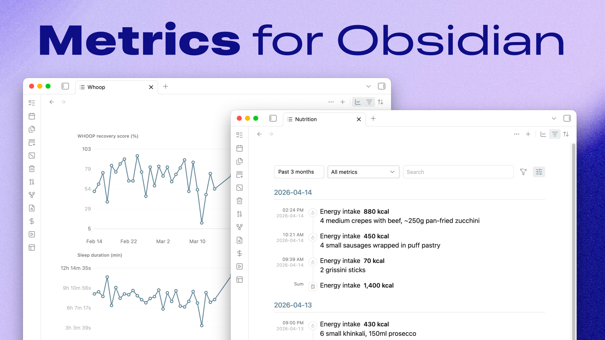

**File-first metrics for Obsidian that keep `*.metrics.ndjson` as the source of truth.**

Metrics is an Obsidian plugin for viewing and editing canonical `*.metrics.ndjson` files inside your vault. It gives you a compact timeline, inline validation, cross-file search, filtering, grouping, summaries, and charts without introducing a hidden database or cache layer.

## Why

The goal is to make metrics feel like normal vault data instead of app-owned state:

- metrics stay as plaintext files in your vault
- each line is one JSON object, so the data stays diffable and scriptable
- the plugin acts as a lens over the file instead of taking ownership of it
- validation issues are surfaced directly in the view instead of being silently swallowed

## Features

- Dedicated metrics view for supported files
- Current-file record create, edit, and delete
- Missing-id assignment for legacy rows
- Metrics file create, rename, and delete
- Cross-file command-palette search that jumps to the matching row
- Filtering by time range, metric, source, validation status, and free text
- Sorting by newest, oldest, value high-low, and value low-high
- Grouping by day, week, month, year, metric, or source
- Optional derived summary rows for average, median, minimum, maximum, sum, and count
- Optional charts driven by the same visible rows as the timeline
- Per-file view state persistence
- Stable plain-text references such as `metric:<id>`
- Catalog-backed metric labels, units, icons, and formatting

## Install

Metrics currently targets Obsidian `1.6.0+`.

For a local install:

```bash
npm install
npm run build
```

Then copy these files into your vault plugin folder:

```text
.obsidian/plugins/metrics-lens/
├── manifest.json
├── main.js
└── styles.css
```

After that, enable `Metrics` in Obsidian's community plugins screen.

## Metric files

Each line in a metrics file is one JSON object.

Required fields:

- `id`
- `ts`
- `key`
- `value`
- `source`

Optional fields:

- `date`
- `unit`
- `origin_id`
- `note`
- `context`
- `tags`

Example:

```json
{"id":"01JV7RK8Q4X60M0E2N0A6QK61V","ts":"2026-04-14T08:30:00+04:00","key":"body.weight","value":105.6,"unit":"kg","source":"withings"}
{"id":"01JV7RM60M9X1Y9G7TWJ3CF8ES","ts":"2026-04-14T09:10:00+04:00","key":"nutrition.energy_intake","value":720,"unit":"kcal","source":"manual","note":"breakfast"}
```

Default conventions:

- metrics root: `Metrics/`
- supported extension: `*.metrics.ndjson`
- default write target: `Metrics/All.metrics.ndjson`
- default record reference prefix: `metric:`

Validation behavior:

- unknown metric keys are allowed and shown as warnings
- unknown units are allowed and shown as warnings
- known-key and unit mismatches are warned instead of silently normalized
- duplicate `id` values are treated as errors and block safe record mutations

## Commands

Current command set:

```text
Open current metrics file
Open metrics view
Search metrics
Add record to current metrics file
New metrics file
Rename current metrics file
Delete current metrics file
Assign missing ids in current metrics file
```

Record-level copy, edit, and delete actions are available from the timeline row menu.

## Settings

The plugin includes a small settings pane for vault-level conventions:

- metrics root folder
- supported extensions
- default write file
- record reference prefix
- week start day
- day start hour for time ranges and date-derived grouping
- metric label display mode: friendly names or canonical keys
- metric icon visibility
- custom metric catalog entries and advanced JSON

## Built-in catalog

The first-party catalog lives in [`src/metric-catalog.json`](src/metric-catalog.json).

It drives:

- metric labels in rows, filters, and charts
- allowed units and unit formatting
- icon mapping
- record modal suggestions

Unknown keys remain allowed by the file contract so the plugin stays file-first and user-extensible.

## Custom catalog

Custom catalog entries are stored in this plugin's per-vault settings as a versioned JSON object. The plugin merges custom entries over the built-in catalog and uses the merged catalog for validation warnings, labels, unit formatting, icons, and record modal suggestions.

The settings tab includes structured editors for custom metrics and custom units. Rows with catalog-related validation warnings also include catalog actions in the row menu, so an unknown metric can be added directly from the flagged record.

The advanced JSON editor stores only the custom delta:

```json
{
  "schemaVersion": 1,
  "categories": {
    "training": {
      "label": "Training",
      "iconCandidates": ["activity"]
    }
  },
  "metrics": {
    "training.run_distance": {
      "label": "Run distance",
      "category": "training",
      "allowedUnits": ["km"],
      "defaultUnit": "km",
      "fractionDigits": 2,
      "iconCandidates": ["activity"]
    }
  },
  "units": {
    "serving": {
      "label": "Serving",
      "display": "serving",
      "aliases": ["servings"],
      "fractionDigits": 1
    }
  }
}
```

New metrics require `label`, `category`, and at least one `allowedUnits` entry. New units and categories require `label`. Existing built-in entries can be partially overridden by key.

## Development

Install dependencies and start watch mode:

```bash
npm install
npm run dev
```

Build once:

```bash
npm run build
```

Run type-checking:

```bash
npm run check
```

For local vault development, place the built plugin in:

```text
.obsidian/plugins/metrics-lens
```

## Release process

Releases are published by GitHub Actions when you push a bare semantic version tag that matches `manifest.json`.

```bash
npm run check
npm run build
git tag 0.6.0 # replace with the manifest version
git push origin 0.6.0
```

Do not use a `v` prefix. Obsidian requires the GitHub Release tag to exactly match the version in `manifest.json`.

The release workflow validates the tag, `manifest.json`, and `package.json`, builds the production bundle, writes categorized release notes from conventional commit messages, and uploads the Obsidian release assets:

- `manifest.json`
- `main.js`
- `styles.css`

## License

[MIT](./LICENSE)
